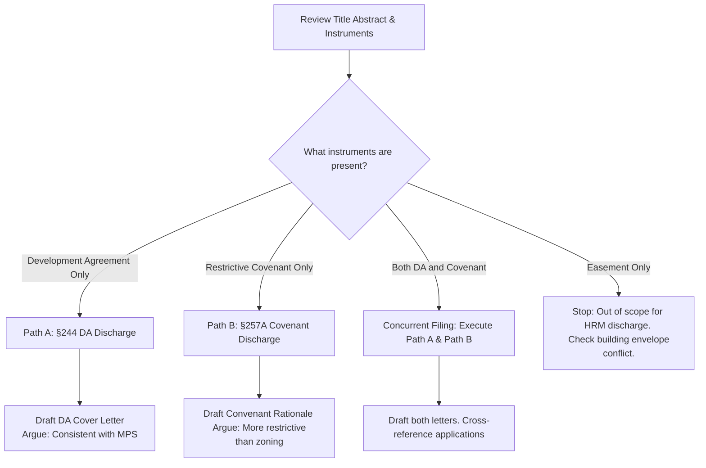

# Quick Reference Summary

## Side-by-Side Comparison Table

| Feature | §244 DA Discharge | §257A Covenant Discharge |
| :--- | :--- | :--- |
| **Legal basis** | HRM Charter Part VIII, §244 | HRM Charter §257A (added 2023) |
| **Decision maker** | Community Council (resolution) | CAO — administrative decision |
| **Public hearing required?** | No | No |
| **Test for approval** | Reasonably consistent with MPS | Covenant more restrictive than current zoning re height/density |
| **Core documents** | DA instrument + cover letter | Covenant instrument + rationale letter |
| **Professional stamp required?** | No | No |
| **Blocks building permit?** | Yes — must be discharged | No — but civil litigation risk remains undischarged |
| **Typical timeline** | 8–16 weeks (Council meeting dependent) | 8–12 weeks (CAO decision) |
| **Appeal route** | NS Regulatory and Appeals Board (14 days) | NS Regulatory and Appeals Board |
| **File where?** | HRM PPLC portal | HRM PPLC portal |
| **Application type in PPLC** | 'Discharge of Development Agreement' | 'Modification or Discharge of a Private Covenant' |

---

## Visual Diagnostic Decision Tree

## Concurrent Filing Strategy
When a client's title has both a DA and a covenant, file both applications at the same time. They use overlapping source documents and the same project rationale, so the marginal effort to file the second application after preparing the first is minimal.

The two applications run in parallel tracks:
- The **DA discharge** goes to Community Council.
- The **covenant discharge** goes to the CAO. 
Both resolve within a similar timeframe, ensuring maximum efficiency and minimal project delay.

## Fees Expections
Application fees for planning applications of this type are typically in the **$500–$1,500** range. Document pull costs from NSPOL are minimal ($10–$50).
